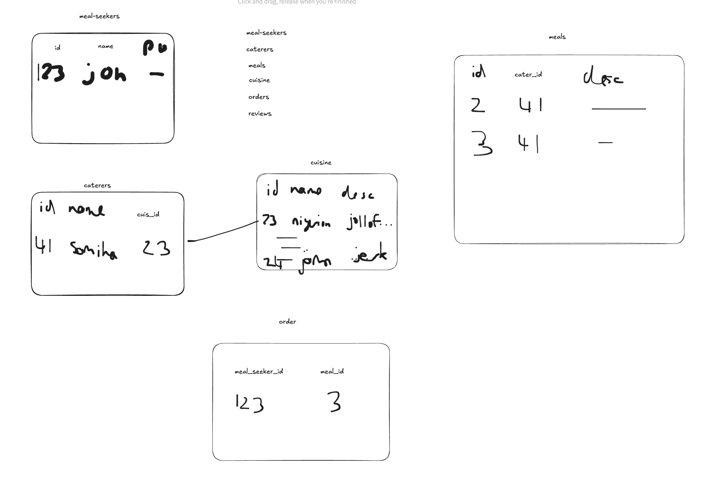

# Project Title

EthnicBite

## Overview

EthnicBite is a web application designed to connect immigrants and international students in Canada with home-cooked meals from their cultural backgrounds. It serves as a bridge between individuals seeking traditional meals and local caterers or skilled home cooks who specialize in specific cuisines.

### Problem Space

Many immigrants and international students struggle to find affordable and authentic home-cooked meals that reflect their cultural heritage. Restaurants may offer commercialized versions of ethnic dishes, but they often lack the authentic flavors, preparation methods, and affordability of home cooking. EthnicBite aims to address this issue by providing a platform where people can request and order traditional home-cooked meals from verified caterers or home chefs.

### User Profile

Meal Seekers:

Immigrants, international students, and anyone looking for authentic ethnic home-cooked meals.

Need access to affordable and traditional home-cooked meals.

Require a user-friendly way to browse, request, and order meals.

Caterers/Home Cooks:

Skilled individuals offering home-cooked meals for their community.

Need an easy way to showcase their meals, availability, and pricing.

Require a system to receive and manage meal requests/orders.

Special Considerations:

Ensuring a seamless and intuitive user experience.

Implementing trust and safety features, such as user reviews and verified caterers.

Supporting diverse dietary preferences and restrictions (e.g., vegetarian, halal, gluten-free optio

### Features

User Authentication:

Users can sign up/login as a meal seeker or caterer.

Meal Posting & Requests:

Meal seekers can browse available meals or post specific meal requests.

Caterers can list meals they offer along with pricing and availability.

Search & Filtering:

Users can search for meals based on cuisine, dietary restrictions, location, and price.

Order & Communication System:

Meal seekers can place orders and communicate with caterers through an in-app messaging system.

Reviews & Ratings:

Users can rate and review meals and caterers to ensure quality and trust.

Secure Payments (Future Implementation):

Users will be able to make payments directly through the platform.

## Implementation

### Tech Stack

Frontend: HTML, SCSS, JavaScript, React.js

Backend: Node.js, Express.js

Database: MySQL

Authentication: Firebase Authentication or JWT-based auth

Hosting: Netlify (Frontend), Heroku (Backend)

Version Control: Git/GitHub

### APIs

Google Maps API (for location-based filtering)

Firebase Authentication API (for user authentication)

(Optional) Payment API (Stripe or PayPal for future implementation)

### Sitemap

Home Page: Overview of the platform, search bar, and featured meals.

Login/Signup Page: User authentication.

Dashboard:

-- > Meal seekers: Browse meals, request meals.

-- > Caterers: Manage meal listings, orders.

Meal Details Page: Individual meal listings with details, pricing, and order options.

Order Page: Order summary and messaging system.

Profile Page: User account settings and order history.

### Mockups

#### Home Page

#### Sign-up Page

#### Login Page

#### Reg Caterer

### Data

Users (Meal Seekers & Caterers) :

id, name, email, role, profilePicture, location

Meals :

id, name, description, price, cuisineType, catererId, availability

Orders :

id, mealId, seekerId, catererId, status, timestamp

Reviews :

id, mealId, seekerId, rating, comment

### Endpoints

**User Authentication**

**POST /users/register**

Register a new user

_Parameters:_

name: User's name (string)

email: User's email (string)

password: User's password (string)

Response:

{
"token": "eyJhbGciOiJIUzI1NiIsInR5cCI6IkpXVCJ9..."
}

**POST /users/login**

**Authenticate a user**

_Parameters:_

email: User's email (string)

password: User's password (string)

Response:

{
"token": "eyJhbGciOiJIUzI1NiIsInR5cCI6IkpXVCJ9..."
}

**Meal Listings**

**GET /meals**

Retrieve all meals

Response:

[
{
"id": 1,
"name": "Jollof Rice",
"description": "A delicious West African dish",
"price": 15,
"cuisineType": "Nigerian",
"availability": true
}
]

**POST /meals**

Create a new meal (Caterers only)

_Parameters:_

name: Meal name (string)

description: Meal description (string)

price: Price (number)

cuisineType: Cuisine category (string)

availability: Availability status (boolean)

Response:

{
"id": 2,
"name": "Biryani",
"description": "Aromatic rice dish",
"price": 12,
"cuisineType": "Indian",
"availability": true
}

**GET /meals/:id**

Retrieve meal details

Response:

{
"id": 2,
"name": "Biryani",
"description": "Aromatic rice dish",
"price": 12,
"cuisineType": "Indian",
"availability": true
}

**Orders**

**POST /orders**

Place a new order

_Parameters:_

mealId: Meal ID (number)

seekerId: User ID (number)

Response:

{
"orderId": 101,
"mealId": 2,
"status": "Pending"
}

**GET /orders/:id**

Retrieve order details

Response:

{
"orderId": 101,
"mealId": 2,
"status": "Pending"
}

## Roadmap

Sprint 1: Week 1 (March 11 - March 17)

Finalize project scope and wireframes

Set up repository, project structure, and environment

Implement basic authentication (Firebase or JWT-based auth)

Develop Home Page UI and static content

Sprint 2: Week 2 (March 18 - March 24)

Develop Login/Signup Page with authentication

Create Meal Listings Page (UI only, minimal interactivity)

Implement backend API for meal listings

Connect frontend to backend for fetching meals

Sprint 3: Week 3 (March 25 - March 27)

Implement basic order functionality (Minimal UI interaction)

Add styling refinements and responsive design improvements

Test core features and fix critical bugs

Prepare presentation and demo

Scope for Presentation:

Showcase Home Page, Login/Signup Page, and Meal Listings Page

Demonstrate limited functionality (authentication, fetching meal listings, minimal ordering system)

Explain future development plans

## Future Implementations

Payment Integration

Subscription Model

Mobile App

Multilingual Support
